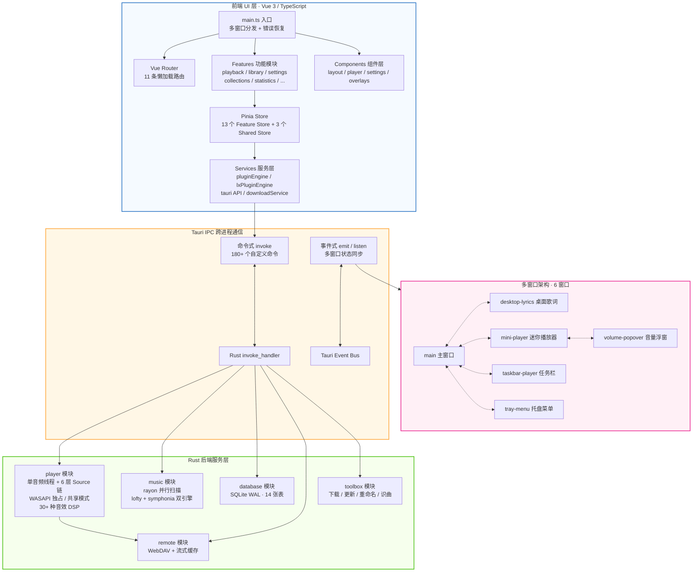

<div align="center">


# XY Music

一款在 **[XY Music](https://github.com/Billy636/LyciaMusic)** 原版基础上界面极简化的极简在线音乐播放器，保留了原版 XY Music 的大部分功能,适合极简风格爱好者使用。

 [](https://tauri.app/)
 [](https://vuejs.org/)
 [](https://www.typescriptlang.org/)
 [](https://www.rust-lang.org/)
 [](https://tailwindcss.com/)

[](https://github.com/kaishui-server/XY-Music-Desktop/commits/main)
 [](https://github.com/kaishui-server/XY-Music-Desktop/stargazers)
 [](https://github.com/kaishui-server/XY-Music-Desktop/graphs/contributors)
 [](./LICENSE)

</div>

## ✨ 功能亮点

- 🎨 **高颜值沉浸式 UI**
  
  - **动态背景系统**：提供类似 Apple Music 的液态网格渐变效果，背景颜色可根据当前播放曲目的专辑封面色彩动态演变，同时支持静态模糊与自定义用户皮肤。
  - **毛玻璃与美学视觉**：使用高度精致的半透明磨砂设计，与操作系统原生环境完美融合。
  - **响应式界面排版**：经典侧边栏导航，搭配“抽屉式”播放队列设计，提供极佳的交互体验。
- 🚀 **深度性能优化**
  
  - **秒开防白屏**：深度定制的主窗口冷启动主题色骨架屏，避免任何初始白屏闪烁。
  - **敏捷资源加载**：基于路由的懒加载机制与异步组件挂载，保障界面交互始终保持极高帧率。
  - **安全并发控制**：在 Rust 后端扫描大型音乐库时，采用信号量（Semaphore）对元数据和封面处理进行节流，有效抑制 CPU 突发飙升。
- 🛠️ **系统原生整合**
  
  - **系统级集成**：完美支持系统媒体通知控制、Windows 媒体按键响应以及系统托盘快速操作。
  - **无缝本地管理**：提供高性能的本地音频文件扫描、标签元数据读取和物理文件重命名与整理。
  - **高级交互体验**：自研智能边界检测的上下文菜单，禁用浏览器默认右键行为，提供真正的原生应用质感。
  - **桌面歌词悬浮窗**：轻量化、高性能的桌面浮窗歌词，支持锁定、穿透与自定义样式。
- 📝 **歌词解析与文件管理**
  
  - **全格式歌词**：支持音频文件内嵌标签歌词、同名 `.lrc` 文件解析，以及基于 AMLL 的歌词逐字动画渲染。
  - **物理整理与库更新**：内置文件夹管理模式，支持批量重命名预览、外部音频标签编辑器与无感入库刷新。

---

## 📸 界面截图

当前仓库未包含 `screenshots/` 截图资源目录，避免 README 中保留失效图片链接。后续补充截图资源后，可在此处恢复截图展示。

---

## 🛠️ 使用源码构建运行

### 环境要求

| 依赖项 | 推荐版本 / 要求 |
| --- | --- |
| **Node.js** | `>= 18` |
| **Rust** | Stable 稳定版最新版本 |
| **操作系统** | Windows 10 / 11 |
| **WebView2** | 确保系统已安装 WebView2 运行时 (Windows 11 默认内置) |

### 运行与构建步骤

1. 克隆本仓库：
  
  ```bash
  git clone https://github.com/kaishui-server/XY-Music-Desktop.git
  cd XY-Music-Desktop
  ```
  
2. 安装依赖项：
  
  ```bash
  npm install
  ```
  
3. 启动 Tauri 桌面端开发调试：
  
  ```bash
  npm run tauri dev
  ```
  
4. 仅在浏览器中调试前端页面：
  
  ```bash
  npm run dev
  ```
  
5. 构建生产环境安装包：
  
  ```bash
  npm run tauri build
  ```
  

---

## 📐 技术架构

XY Music 采用 Tauri 2.x 驱动的前后端分离架构，前端 Vue 3 负责 UI 渲染与状态管理，Rust 后端负责音频引擎、数据库、文件扫描等高性能计算，两者通过 Tauri IPC（命令式 `invoke` + 事件式 `emit/listen`）进行跨进程通信。



### 前端架构

采用 **Feature-based 模块化** 设计，每个功能领域自包含 Store + Composable + 辅助逻辑，而非按技术层分目录：

> 播放与音乐库领域的权威实现位于 `src/features/playback/`、`src/features/library/`。`src/composables/player*.ts` 仅保留少量旧路径兼容再导出，新增业务逻辑和测试应优先落在 `features/`，避免重构中间态继续扩散。

| 层级 | 说明 |
| --- | --- |
| **入口 `main.ts`** | 创建 Vue 应用，安装 Pinia + Router；通过 `getCurrentWindow().label` 分发到 6 个窗口的独立渲染逻辑；三重错误捕获 + 动态导入失败自动刷新恢复 |
| **路由 `router/`** | 11 条懒加载路由（首页 / 收藏 / 最近 / 歌手 / 专辑 / 插件 / 设置 / 认证 / 搜索 / 在线详情 / 引导），含 onboarding 路由守卫 |
| **功能模块 `features/`** | 13 个自包含模块：`playback`（播放+音效双 Store）、`library`（音乐库 songPool + intern pool 高性能设计）、`settings`（全局设置中心）、`collections`（收藏歌单）、`desktopLyrics` / `miniPlayer` / `taskbarPlayer` / `tray`（窗口纯逻辑模块）、`download` / `auth` / `onlineDetail` / `lyricsSettings` / `statistics` |
| **共享 Store `shared/stores/`** | 跨功能状态：`ui`（面板可见性）、`navigation`（导航/搜索历史）、`audioExport`（导出进度） |
| **组件 `components/`** | 按域划分：`layout`（Shell/侧边栏/底栏/标题栏）、`player`（播放详情/歌词/可视化/队列）、`settings`（15 个设置面板）、`overlays`（右键菜单/弹窗）、`home` / `song-list` / `statistics` |
| **服务层 `services/`** | `pluginEngine`（MusicFree 插件引擎，82KB）、`lxPluginEngine`（落雪插件引擎）、`tauri/`（API 封装）、`downloadService` |
| **构建优化** | Vite 手动分包：`vendor-vue` / `vendor-pixi`（流光背景）/ `vendor-amll`（AMLL 歌词）/ `vendor-utils` / `vendor-tauri`；WASM + TopLevelAwait 插件支持 |

### 后端架构

Rust 后端由多个业务模块组成，通过 `src-tauri/src/lib.rs` 集中注册 `#[tauri::command]`。命令数量随功能迭代变化较快，实际可调用清单以 `tauri::generate_handler![...]` 中的注册项和 `src-tauri/capabilities/*.json` 的权限分组为准。

| 模块 | 职责 | 关键技术 |
| --- | --- | --- |
| **`player/`** | 音频播放引擎 | 单音频线程 + mpsc 命令通道；6 层 Source 链（BufferedSource → VolumeNormalizer → Equalizer → SoundEffect → UserVolume → ClipGuard → TimedSource）；WASAPI 独占模式 + cpal 共享模式双后端；无锁可视化环形缓冲（AtomicU32）；vendored rodio 定制 100ms 缓冲 |
| **`player/sound_effect/`** | 30+ 种音效 DSP | 变调变速（OLA）、10 段 EQ（Biquad 级联）、Freeverb + 卷积混响、3D/8D/36D 环绕、压缩/限制/激励器/LoFi；Mutex + dirty flag 非阻塞音频线程同步 |
| **`music/`** | 音乐库管理 | rayon 并行增量扫描（mtime/size diff）；lofty + symphonia 双引擎标签解析；CUE 整轨分割；封面双级缓存（150px + 800px，LRU 4GB） |
| **`database/`** | SQLite 数据持久化 | WAL 模式 + NORMAL 同步；14 张表（songs / artists / song_artists / play_history / song_stats / daily_stats / song_loudness / remote_sources ...）；增量迁移 |
| **`remote/`** | 远程音源 | WebDAV PROPFIND/GET（quick-xml）；流式缓存（SHA256 命名，LRU 5GB）；播放 50% 预缓存整曲 |
| **`toolbox/`** | 工具箱 | reqwest 流式下载（进度事件）；音频元数据嵌入；更新检查；文件重命名（tags/rules/auto）；听歌识曲（内置 MD5 + 酷狗指纹接口） |

### IPC 通信与插件系统

**双通道 IPC**：命令式 `invoke()`（180+ 个自定义命令，覆盖播放/库/统计/窗口/插件/下载全场景）+ 事件式 `emit/listen`（多窗口实时状态同步，含 Ready 握手 → State 推送 → State Applied 确认 → Action 回传完整协议）。

**双格式插件引擎**：同时兼容 MusicFree 与 LX 落雪两种插件格式，所有插件 HTTP 请求通过 Rust 后端 `plugin_http_request` 代理（绕过 WebView CORS），自动处理 Cookie 注入、图片代理（Referer 伪装）、插件云端同步。

### 多窗口架构

6 个窗口共享同一前端应用，通过 `window.label` 路由到不同组件：

| 窗口 | 用途 | 特性 |
| --- | --- | --- |
| `main` | 主窗口完整界面 | 无边框透明，1200×800 |
| `desktop-lyrics` | 桌面歌词悬浮窗 | 置顶 + 穿透 + 自定义样式 |
| `mini-player` | 迷你播放器 | 置顶 + 启动预热 |
| `taskbar-player` | 任务栏播放控制条 | Win32 `WS_EX_NOACTIVATE` 不抢焦点 + Z 序守护 |
| `tray-menu` | 系统托盘菜单 | 智能定位 + 子菜单展开方向检测 |
| `volume-popover` | 迷你播放器音量浮窗 | 独立浮窗 + 与迷你播放器联动 |

### 技术栈

| 层级 | 技术 |
| --- | --- |
| **前端** | Vue 3.5 (Composition API)、Vite 6、TypeScript 5.6、Tailwind CSS 4.0、Pinia 3、Vue Router 4、AMLL（Apple Music 风格歌词）、PixiJS（流光背景）、TanStack Virtual（虚拟列表） |
| **后端** | Rust (edition 2021)、Tauri 2.x、rodio 0.20（vendored 定制）、cpal 0.15、symphonia 0.5、lofty 0.21、rusqlite 0.38（bundled SQLite）、souvlaki 0.7（SMTC 系统媒体控制）、rustfft 6.4、reqwest 0.12、wasapi 0.23（独占模式） |
| **数据库** | SQLite（WAL 模式，14 张表，增量迁移） |
| **构建工具** | Vite 6 + WASM 插件、vitest（前端测试）、cargo test（Rust 测试）、NSIS（Windows 安装包） |

---

## 💝 特别致谢 

- **[Lycia Player](https://github.com/Billy636/LyciaMusic)**：本项目的UI设计、基础技术框架、本地播放引擎均由原项目实现。特此向其作者及所有贡献者致以最诚挚的谢意！

---


## ⚖️ 许可与资产声明

- **开源协议**：本项目基于 **AGPL-3.0-only** 许可协议开源，完整协议内容及歌词改编归属说明请分别参阅 [LICENSE](LICENSE) 与 [NOTICE](NOTICE)。
- **资产版权**：本项目内包含的所有视觉资产（包括但不限于应用 Logo、插图、截图等）均属原作者[Billy636](https://github.com/Billy636)个人及 XY Music 开发团队（后称原团队）所有。未经原团队明确授权，请勿将这些图片资产用于任何商业用途或二次分发。

---

*更新日期：2026-08-03*
